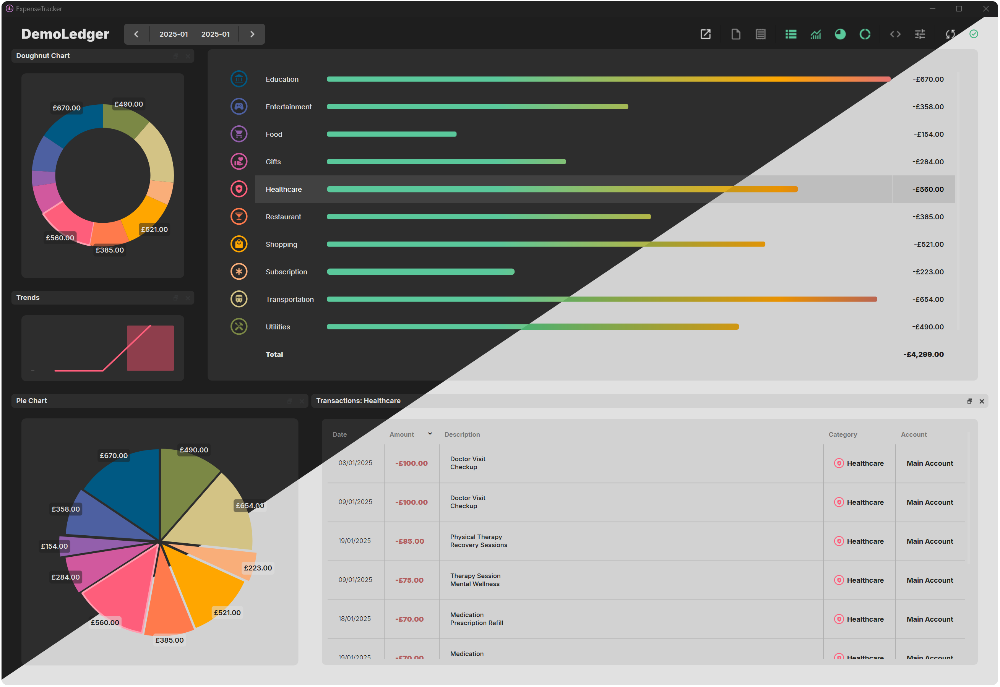

ExpenseTracker
==============

.. image:: https://img.shields.io/badge/License-GPLv3-black.svg
   :target: https://opensource.org/license/gpl-3-0
   :alt: License: GPLv3

.. image:: https://img.shields.io/badge/Python-Python3.11+-black.svg
   :alt: Python 3.11+
   :target: https://www.python.org/downloads/release/python-3110

   
.. image:: https://img.shields.io/badge/Qt-PySide6-black.svg
   :alt: Qt6/PySide6
   :target: https://doc.qt.io/qtforpython-6/index.html

.. image:: https://github.com/wgergely/ExpenseTracker/actions/workflows/test.yml/badge.svg
   :alt: Test

------

**ExpenseTracker is a personal finance tool for visualizing expense transactions kept in Google Sheets.**

-------

ExpenseTracker is designed for folk who already track their spending using Google Sheets and need a practical way to
visualize their expenses by category and period.

What does it do?
++++++++++++++++

ExpenseTracker is limited and boots a limited feature set:

| ✅ Fetches data from Google Sheets and display expenses by period and categories
| ✅ You can save presets to allow switching between multiple sources and or insights
| ✅ Browse and edit category transactions
| ✅ Basic data visualization widgets

| ❌ Source data editing isn't fully supported (only category editing is)

If there's an important feature missing, please lodge a request as an issue on Github.

Quick Start
++++++++++++++++

You can download and install the latest release (Windows only, sorry!) from Github:

| 🔽 `Latest Release on Github <https://https://github.com/wgergely/ExpenseTracker/releases/>`_

Google Cloud Platform
++++++++++++++++++++++++

You'll have to set up a Google Cloud Platform (GCP) project and an OAuth 2.0 client ID to authenticate the app with your
own credentials. This one-time setup is a little cumbersome but it is necessary to access your Google Sheets data.

1) Go to the `Google Cloud Console <https://console.cloud.google.com/>`_
2) Create a new project (`help <https://developers.google.com/workspace/guides/create-project/>`_)
3) `Enable <https://console.cloud.google.com/apis/library>`_ the Google Sheets API for your project (`help <https://cloud.google.com/endpoints/docs/openapi/enable-api>`_)
4) `Create <https://console.cloud.google.com/apis/credentials>`_ OAuth 2.0 credentials (`help <https://developers.google.com/workspace/guides/create-credentials>`_):
    * Click on "Create credentials" and select "OAuth client ID".
    * Select "Desktop app" as the application type and give it a name (e.g. "ExpenseTracker").
    * Download the credentials JSON file (you'll need it later).

    The credentials file will look something like this:

    .. code-block:: json

       {
          "installed": {
            "client_id": "<CLIEND-ID>.apps.googleusercontent.com",
            "project_id": "<PROJECT-ID>",
            "auth_uri": "https://accounts.google.com/o/oauth2/auth",
            "token_uri": "https://oauth2.googleapis.com/token",
            "auth_provider_x509_cert_url": "https://www.googleapis.com/oauth2/v1/certs",
            "client_secret": "secret",
            "redirect_uris": [
              "http://localhost"
            ]
          }
        }

Contact
=======

| Gergely Wootsch
| Email: `hello+ExpenseTracker@gergely-wootsch.com <hello+ExpenseTracker@gergely-wootsch.com>`_

.. toctree::
   :maxdepth: 2
   :caption: Contents:

   user_guide/index
   api/index